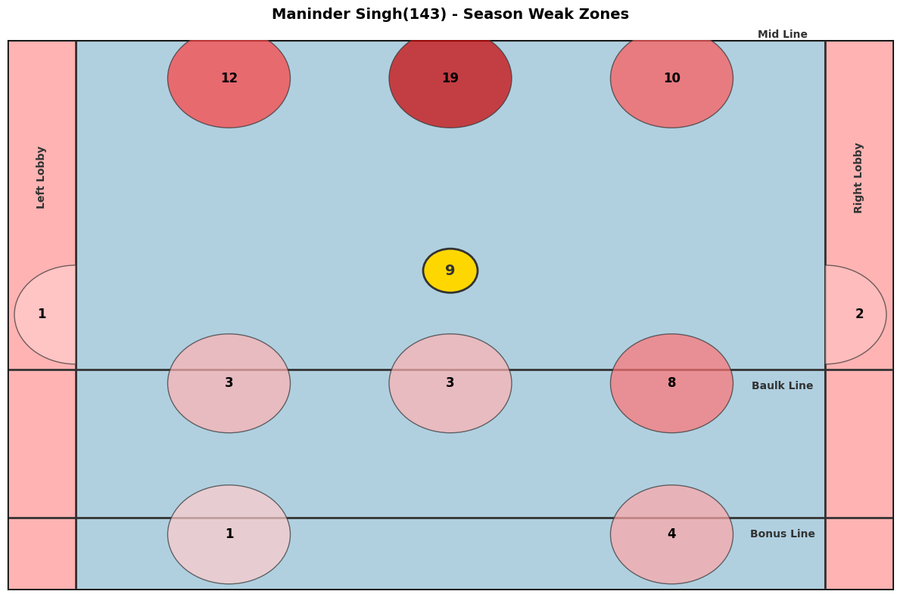

## `plot_player_zones_improved(player_id, season, zone_type='strong')`

Visualize a player's strong or weak zones on the kabaddi court for a specific season.

### Parameters:
- `player_id` (int): The unique identifier for the player.
- `season` (int): The season number for which the data will be retrieved.
- `zone_type` (str): Type of zones to plot, either `'strong'` or `'weak'`.

### Example Usage:
```python
plot_player_zones_improved(player_id=143, season=5, zone_type='strong')
plot_player_zones_improved(player_id=143, season=5, zone_type='weak')
```


Notes:
 - The function plots a heatmap of a player's strong or weak zones during a season on the kabaddi court.
 - Each zone's intensity reflects the player's performance in that zone.
 - Raises ValueError if the season is invalid or no data is found for the specified player.

---

## `plot_team_zones(team_id, season, zone_type='strong')`

Visualize a team's strong or weak zones on the kabaddi court for a specific season.

### Parameters:
- `team_id` (int): The unique identifier for the team.
- `season` (int): The season number for which the data will be retrieved.
- `zone_type` (str): Type of zones to plot, either `'strong'` or `'weak'`.

### Example Usage:
```python
plot_team_zones(team_id=4, season=5, zone_type='strong')
plot_team_zones(team_id=4, season=5, zone_type='weak')
```

Notes:
- The function creates a heatmap that visualizes the team's zone performance across the court.
- Custom color maps are used to highlight strong and weak zone intensities.
- A color bar indicating points is included for easier interpretation.


---


## `plot_point_progression(season, match_id)`

Plot the point progression for both teams throughout a specific match in a given season.

### Parameters:
- `season` (int): The season number for the match.
- `match_id` (int): The unique identifier for the match.

### Example Usage:
```python
plot_point_progression(season=10, match_id=3163)
```

Notes:
- This function visualizes how the total points for each team progressed over the course of the match.
- It highlights important raid events and significant point differences between teams.
- The final score and team names are annotated for easy reference


## `plot_player_zones_grid(player_ids, season, zone_type='strong', max_cols=4)`

Plot a grid of player zone heatmaps for multiple players in a specific season.

### Parameters:
- `player_ids` (list of int): List of player IDs for which the zones will be plotted.
- `season` (int): The season number for which the data will be retrieved.
- `zone_type` (str): Type of zones to plot, either `'strong'` or `'weak'`.
- `max_cols` (int, optional): Maximum number of columns for the grid layout. Defaults to 4.

### Example Usage:
```python
plot_player_zones_grid([143, 12, 211, 322, 160], season=5, zone_type='strong', max_cols=2)
```


Notes:
- This function generates a grid of player zone heatmaps, allowing for side-by-side comparisons of multiple players.
- Invalid player IDs or missing data will be skipped, and only valid plots will be displayed.
- The grid size adjusts based on the number of players and the max_cols setting.